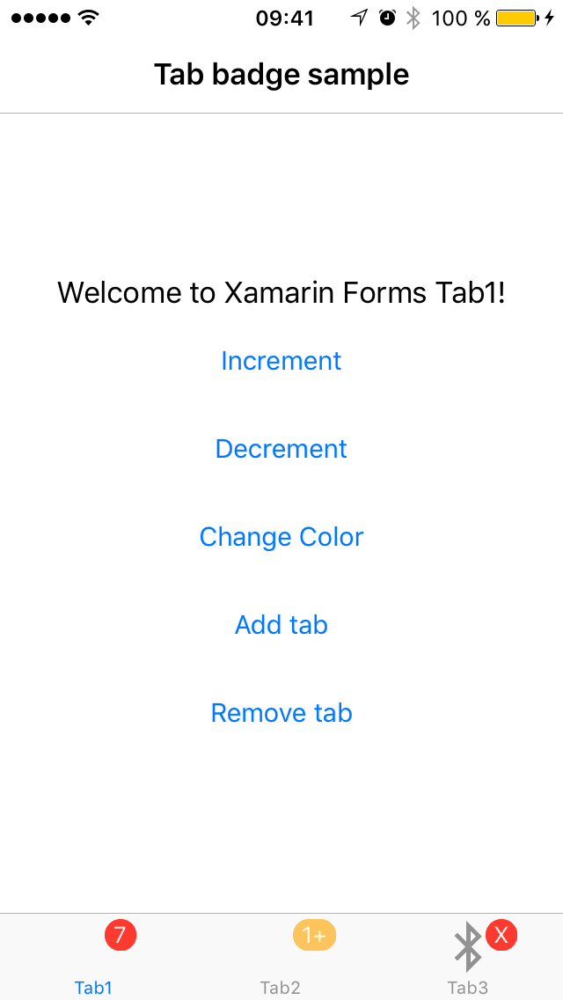
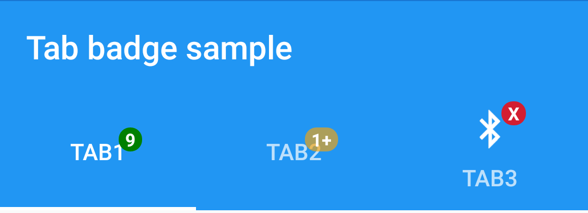
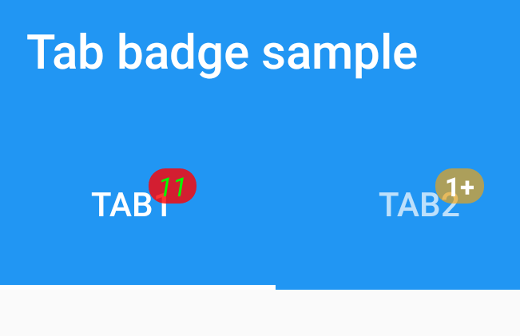
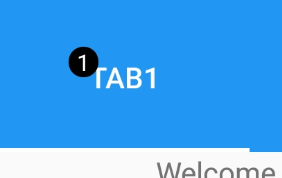
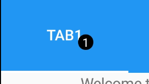

#  xamarin-forms-tab-badge [](https://www.bitrise.io/app/6fbb08a710d8f2aa)
**Xamarin Forms** bindable tab badges for iOS, Android and UWP. The plugin creates a custom renderer (iOS, Android & UWP) and a custom attached property for adding tab bar badges which can be bound in XF shared code.

## Sample


## Support & Limitations

| Feature / Availability  | Xamarin.Android (1) | Xamarin.iOS | UWP (2) | MacOS (3) |
| ------------- | ----------- | ----------- | ----------- | ----------- |
| Bindable Badge Text | ✓ | ✓ (iOS >=8.0) | ✓ | ✓ |
| Bindable Badge Color | ✓ | ✓ (iOS >= 10.0) | ✓ | ✓ |
| Bindable Badge Text Color | ✓ | ✓ (iOS >= 10.0) | ✓ | ✓ |
| Bindable Badge Font | ✓\* | ✓ \*(iOS >= 10.0) | ✓ | ✓ |
| Bindable Badge Postion | ✓ | ✕ | ✓ | ✓ |
| Bindable Badge Margin | ✓ | ✕ | ✓ | ✓ |
| Dynamic tab add/removal | ✓ | On overflow, 'More' / '...' menu don't have badges. | ✓ | ✓ |

\*(1) Min Android **API level 15**

\*(2) **Min UWP version**: Win 10 Fall Creators Update (XF.3 has a .netstandard 2 requirement).

\*(3) **MacOS version**: -

\*\***Font restrictions**: able to bind font attributes and family but not size

## Installation

- Make sure to install the package in your Xamarin.Forms PCL, iOS and Android project.

```
// stable
Install-Package Plugin.Badge
// or pre-release
Install-Package Plugin.Badge -Pre
```
[](https://www.nuget.org/packages/Plugin.Badge) [](https://www.nuget.org/packages/Plugin.Badge)


### iOS, Android, UWP, MacOS

You have to register the custom renderer. I usually put this in the AssemblyInfo.cs file of my Platform specific project (iOS, Android, UWP, MacOS) csproj.

```
[assembly: ExportRenderer(typeof(TabbedPage), typeof(BadgedTabbedPageRenderer))]
```

**Caution**: *If you are using the **NON AppCompat** MainActivity (i.e. you Main activity inherits from FormsApplicationActivity) please register the 'Legacy' renderer*

```
[assembly: ExportRenderer(typeof(TabbedPage), typeof(LegacyBadgedTabbedRenderer))]
```

### Caution - Custom TabbedPage / Custom Renderers

If you are using a custom renderer for TabbedPage please change it to inherit from `BadgedTabbedPageRenderer` and you are all set. Of course dont forget to register your own renderer.

### Linker

As you already know when you enable linkling for your application the linker might remove some of the methods/types/properties/events used by third party libraries. This is why it's necessary to update your `LinkerPleaseInclude.cs`. Check this [blogpost](https://lostechies.com/jimmybogard/2014/11/11/dealing-with-the-linker-in-xamarin-apps/) for more linker info.

- For iOS add the following lines:
```
public void Include(UITabBarItem item)
{
    item.BadgeColor = UIColor.Red;
    item.BadgeValue = "badge";
}
```
- For Android no issues detected yet :). Feel free to report any issues here.

## Usage

### Badge Text

For each **child page** of the TabbedPage just bind the custom attached property 
[`TabBadge.BadgeText` (XAML) or `TabBadge.BadgeTextPropery` (CSharp)]

#### XAML

The important line here is binding the attached property:
```
  plugin:TabBadge.BadgeText="{Binding Count}"
```

Example tabbed page with badged children:
```
<TabbedPage xmlns="http://xamarin.com/schemas/2014/forms"
             xmlns:x="http://schemas.microsoft.com/winfx/2009/xaml"
             xmlns:plugin="clr-namespace:Plugin.Badge.Abstractions;assembly=Plugin.Badge.Abstractions" 
             x:Class="Plugin.Badge.Sample.TabXaml">
  <TabbedPage.Children>
    <ContentPage Title="Tab1" 
                 Icon="icontab1.png"
                 plugin:TabBadge.BadgeText="{Binding Count}">
      <StackLayout>...</StackLayout>
    </ContentPage>
    ...
  </TabbedPage.Children>
</TabbedPage>
```
#### CSharp codebehind

```
var tab1 = new ContentPage //assume this is a child page of your Tab
{
    Title = "Tab1",
    Content = tab1Layout
};

tab1.SetBinding(TabBadge.BadgeTextProperty, new Binding("Count"));
```

### Badge Color

Very similar to `BadgeText` just use [`TabBadge.BadgeColor` (XAML) or `TabBadge.BadgeColorPropery` (CSharp)].



### Badge Text Color

Very similar to `BadgeColor` just use [`TabBadge.BadgeTextColor` (XAML) or `TabBadge.BadgeTextColorPropery` (CSharp)].


### Badge Font Attributes

Very similar to `BadgeColor` just use [`TabBadge.BadgeFont` (XAML) or `TabBadge.BadgeFontPropery` (CSharp)].



ToDo:
- you can alo try to set font family, should work in theory
- font size is not supported yet on android ......

### Badge Position

Very similar to `BadgeColor` just use [`TabBadge.BadgePosition` (XAML) or `TabBadge.BadgePositionPropery` (CSharp)].

| TopLeft | BottomLeft | BottomRight | Center | TopCenter | BottomCenter | LeftCenter | RightCenter |
| ------------- | ----------- | ----------- | ----------- | ----------- | ----------- | ----------- | ----------- |
|  |  |  |  | | | | |

## Showning / Hiding the badge
If the value of the `BadgeText` is set to null or empty string the badge is hidden. To show it again set a non null or empty value


# Licence

[MIT](https://github.com/xabre/xamarin-forms-tab-badge/blob/master/LICENSE)
