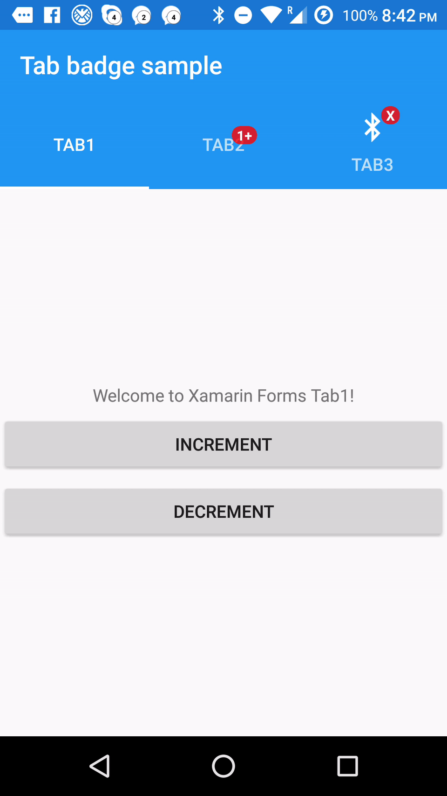

#  xamarin-forms-tab-badge [](https://www.bitrise.io/app/6fbb08a710d8f2aa)
**Xamarin Forms** bindable tab badges for iOS and Android. The plugin creates a custom renderer (iOS & Android) and a custom attached property for adding tab bar badges which can be bound in XF shared code.

## Sample


## Support & Limitations

| Platform  | Version | Limitations |
| ------------- | ----------- | ----------- |
| Xamarin.Android | |  |
| Xamarin.iOS     |  |  |

## Installation

- Make sure to install the package in your Xamarin.Forms PCL, iOS and Android project.

```
// stable
Install-Package Plugin.Badge
// or pre-release
Install-Package Plugin.Badge -Pre
```
[](https://www.nuget.org/packages/Plugin.BLE) [](https://www.nuget.org/packages/Plugin.BLE)


### iOS

In your AppDelegate before calling LoadApplication(..) initialize the renderer (this will stop the linker from forgeting it):
```
    BadgedTabbedPageRenderer.Init();
```

### Android

No linker problems here so you are all set.

### Caution - Custom TabbedPage

For now the custom rendererers override the standard Xamarin Forms renderers for `TabbedPageRenderer` (Android) and `TabbedRenderer(iOS)`. If you are using a custom renderer for TabbedPage please change it to inherit from `BadgedTabbedPageRenderer` and you are all set.

## Usage

For each **child page** of the TabbedPage just bind the custom attached property 
[`TabBadge.BadgeText` (XAML) or `TabBadge .BadgeTextPropery` (CSharp)]

### XAML

The important line here is binding the attached property:
```
  plugin:TabBadge.BadgeText="{Binding Count}"
```

Example tabbed page with badged children:
```
<TabbedPage xmlns="http://xamarin.com/schemas/2014/forms"
             xmlns:x="http://schemas.microsoft.com/winfx/2009/xaml"
             xmlns:plugin="clr-namespace:Plugin.Badge.Abstractions;assembly=Plugin.Badge.Abstractions" 
             x:Class="Plugin.Badge.Sample.TabXaml">
  <TabbedPage.Children>
    <ContentPage Title="Tab1" 
                 Icon="icontab1.png"
                 plugin:TabBadge.BadgeText="{Binding Count}">
      <StackLayout>...</StackLayout>
    </ContentPage>
    ...
  </TabbedPage.Children>
</TabbedPage>
```


### CSharp codebehind

```
var tab1 = new ContentPage //assume this is a child page of your Tab
{
    Title = "Tab1",
    Content = tab1Layout
};

tab1.SetBinding(TabBadge.BadgeTextProperty, new Binding("Count"));
```
